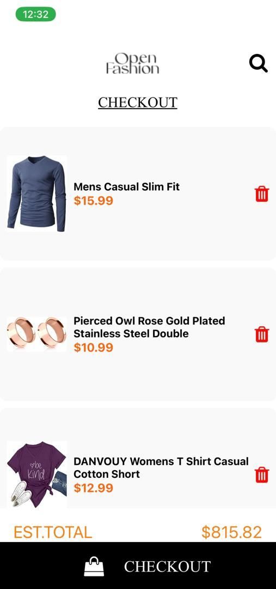

# rn-assignment7-11156875

 ## ShoppingAPP:

## Overview:

This shoppingApp is a React Native application that allows users to browse products, view product details, and add or remove items from the shopping cart. The app fetches product data from an external API and uses local storage to persist cart items.

## Features:

- Home Screen: This screen displays the list of available products in the shoppingApp.
- Product Detail Screen: This screen shows detailed information about a selected product.
- Cart Screen: This screen displays selected items in the cart.
- Drawer Navigation: This gives easy access to the Home, product detail, and Cart screens.
- Add to Cart: This allows users to add items to their cart.
- Remove from Cart: THis allows users to remove items from their cart.
- Data Fetching: Fetches product data from an external API using Axios.
- Local Storage: Uses AsyncStorage to store selected items locally on the device.

## Screenshots:

## Home Screen:

## Drawer:

## Going to the Product detail screen without selecting an item

## Product Detail Screen

## Cart Screen

